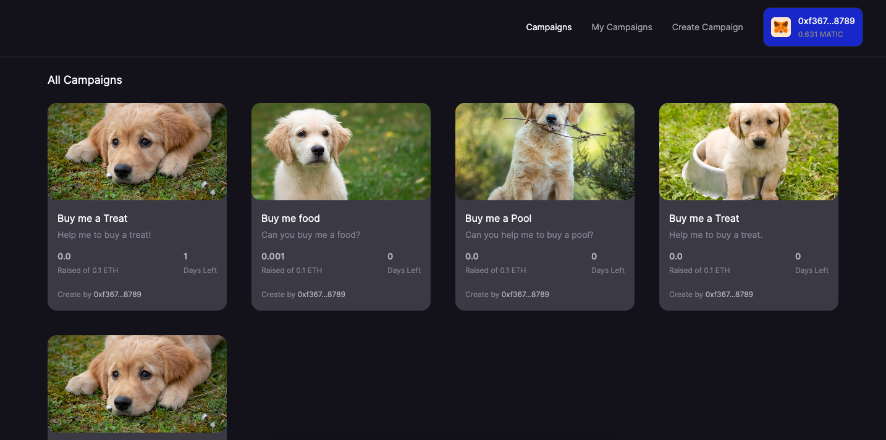
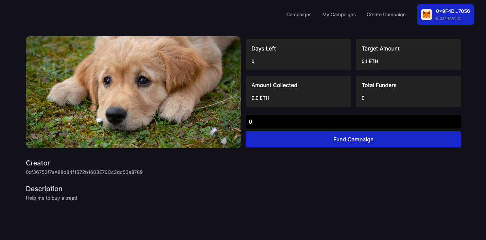
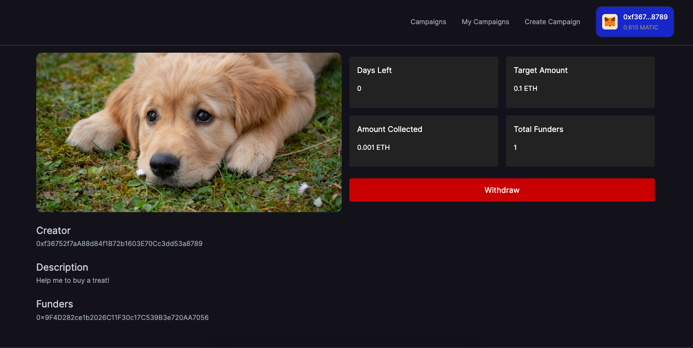
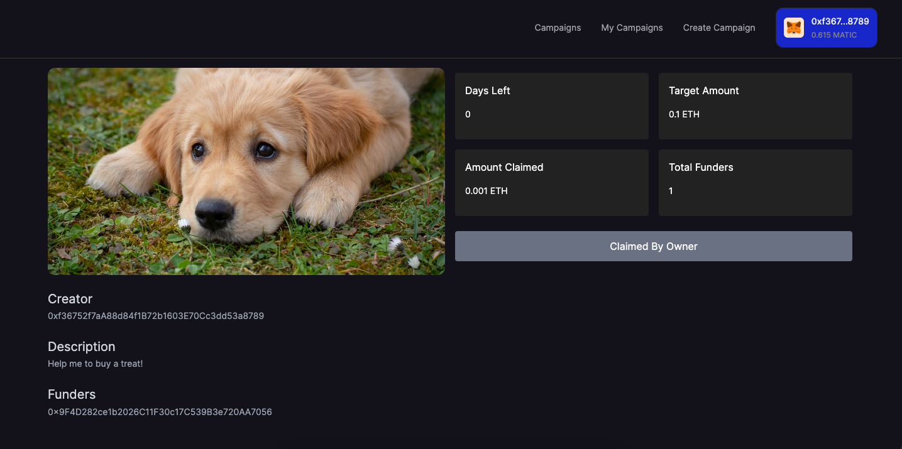

# Crowdfunding

## About

Ethereum-based crowdfunding platform, enabling users to initiate campaigns and attract multiple funders. This decentralized system allows campaign owners to raise funds seamlessly. Utilizing smart contracts, contributors can securely deposit funds, and the campaign owner gains the ability to withdraw funds.

## Smart Contract

## Workflow

### Home

---

### Fund

---

### Withdraw

---

### Owner Claimed

## Thank You :)
